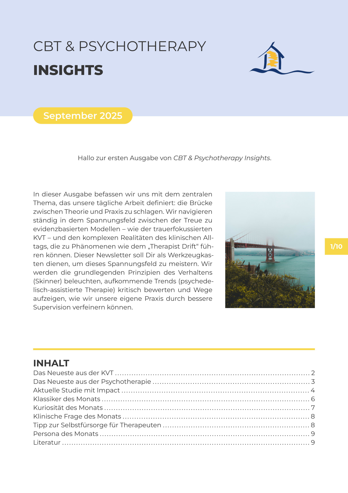
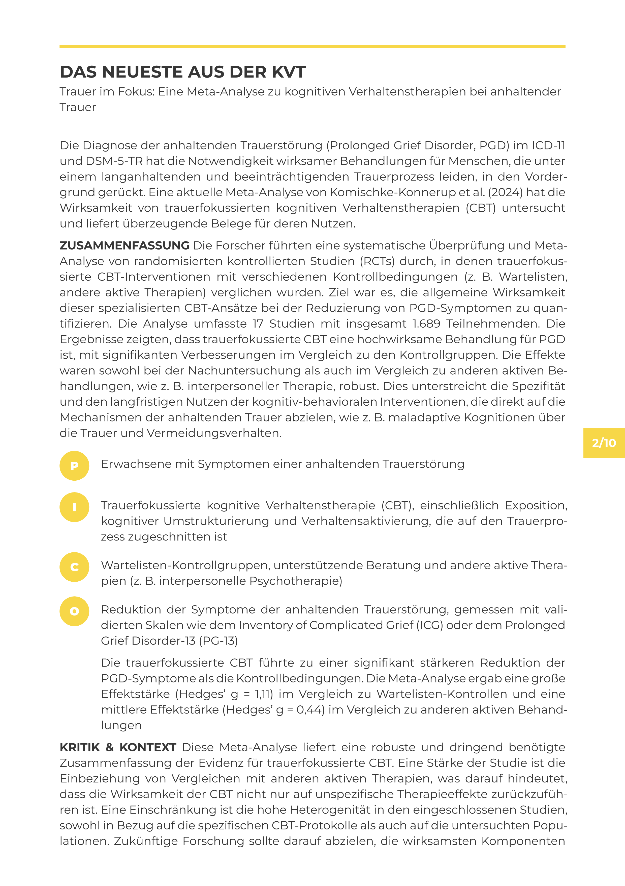

# CBT & Psychotherapy Insight Template

A Typst template for creating the internal CBT and Psychotherapy newsletter. This repository contains all necessary components and an example implementation.

## Preview

This is what the final layout looks like. The template produces a clean, two-column design with recurring visual elements.

| Title Page | Content Page |
| :---: | :---: |
|  |  |


---

## Features

The template was developed to standardize and simplify the newsletter creation process.

* **Pre-made Layout:** Consistent design for the title page, content pages, and final page.
* **Automated Table of Contents:** Automatically generates an overview of all main chapters.
* **Reusable Components:**
    * `#pico()`: A formatted block for the structured summary of scientific studies according to the PICO scheme.
    * `#person-of-the-month()`: A special block to highlight an important personality, including a picture and a quote.
* **Automatic Headers & Footers:** Includes page numbering and graphic accents.
* **Bibliography Management:** Easy integration of a bibliography via a `.bib` file.

---

## Prerequisites

Before you can use the template, please ensure the following requirements are met:

1. **Typst:** A working [Typst installation](https://github.com/typst/typst) is required.
2. **"Montserrat" Font:** This font must be installed on your system. You can download it for free from [Google Fonts](https://fonts.google.com/specimen/Montserrat).

---

## Installation

This template is used as a **local Typst package**. Follow these steps to install it:

1. **Navigate to the Typst package folder:**
    * **Windows:** `%APPDATA%typstpackageslocal`
    * **Linux:** `~/.local/share/typst/packages/local/`
    * **macOS:** `~/Library/Application Support/typst/packages/local/`

2. **Create the package folder structure:** In the `local` folder, create the following directory structure: `cbt-newsletter/0.1.0/`. The name and version must match exactly for the import to work.

3. **Copy the template files:** Copy the entire contents of this Git repository into the newly created `0.1.0` folder. The final structure should look like this:

    ```
    .../typst/packages/local/
    └── cbt-newsletter/
        └── 0.1.0/
            ├── images/
            ├── lib.typ
            ├── references.bib
            └── ... (all other project files)
    ```

---

## Usage

### Basic Structure of Your Newsletter

Every new newsletter starts with the following basic structure. You import the local package and call the main `#newsletter()` function.

```typst
// Import all functions from your local template package
#import "@local/cbt-newsletter:0.1.0": *

// Define the global settings for the newsletter
#show: newsletter.with(
  date: [September 2025],
  welcome: [Hello and welcome to the first issue of _CBT & Psychotherapy Insights_],
  intro-image: image("images/bridge.jpg", width: 100%),
  intro: [
    In this issue, we delve into the central theme that...
  ],
)

// YOUR NEWSLETTER CONTENT STARTS HERE
// ...
```

### Parameters of the `newsletter` function

* `date`: Expects a `content` block. Used to specify the newsletter issue (e.g., `[September 2025]`).
* `welcome`: Expects a `content` block. A short, single-line welcome message on the title page.
* `intro-image`: A Typst `image()` object for the title image.
* `intro`: Expects a `content` block. The introductory text that is displayed next to the image on the title page.

---

## Template Functions (Components)

You use these functions to structure the content of your newsletter.

### `#new-heading()`

Creates a formatted main heading with a yellow bar and an optional subheading.

* `title`: The title of the heading (as a `content` block).
* `introduction`: The introductory sentence below the title (as a `content` block).

**Example:**
```typst
#new-heading(
  "The Latest from CBT",
  "Focus on Grief: A Meta-Analysis...",
)
```

### `#pico()`

Formats a summary of a study according to the PICO scheme.

* `population`: The population studied.
* `intervention`: The intervention performed.
* `comparison`: The comparison group or condition.
* `outcome`: The results of the study.

All arguments expect `content` blocks.

**Example:**
```typst
#pico(
  population: [Adults with symptoms of prolonged grief disorder],
  intervention: [Grief-focused cognitive behavioral therapy...],
  comparison: [Waitlist control groups...],
  outcome: [Reduction in symptoms...],
)
```

### `#person-of-the-month()`

Creates the highlighted block for the "Person of the Month".

* `name`: The name of the person (as a `content` block).
* `picture`: An `image()` object. The image should include the argument `height: 100%` to fill the block correctly.
* `quote`: A quote from the person (as a `content` block).

**Example:**
```typst
#person-of-the-month(
  name: [Judith S. Beck, PhD],
  picture: image("person-of-the-month/judith-beck.jpg", height: 100%),
  quote: [The way people get better is to make small changes...],
)
```

---

## Customization

This template is designed for internal use with a fixed corporate design. Customization of colors, fonts, or layouts is not intended. Its use is focused on applying the functions described above to create content.